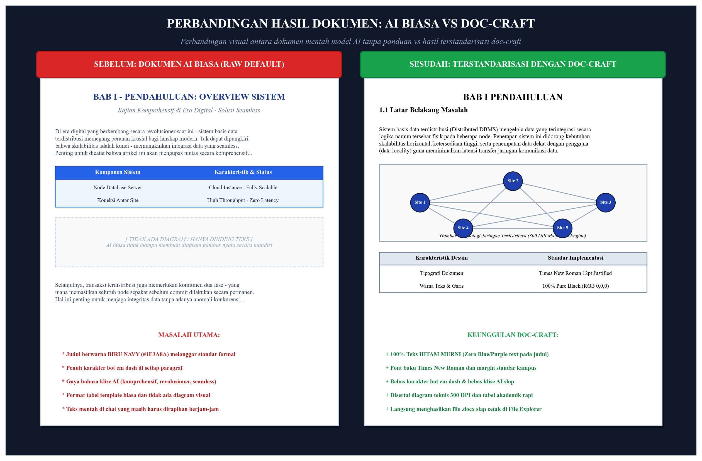

# doc-craft 📄✨

[](LICENSE)
[](https://github.com/Rifaldo-dev)
[]()
[]()
[]()
[-blue.svg)]()

> **Document & Paper Crafting Engine for AI Agents.**  
> Mengubah perintah singkat (*slash command*) atau berkas materi menjadi dokumen Microsoft Word (`.docx`) formal siap cetak dengan margin presisi, teks 100% hitam murni, tabel ilmiah rapi, dan diagram teknis beresolusi tinggi (300 DPI) tanpa *AI slop*.

---

## 📊 Perbandingan Hasil: AI Biasa vs doc-craft (Before & After)

<p align="center">
  
</p>

Berikut adalah perbandingan visual nyata antara dokumen yang dibuat oleh model AI standar tanpa panduan (*Before*) dibandingkan dengan dokumen yang dihasilkan melalui **`doc-craft`** (*After*):

### 1. Matriks Perbandingan Dokumen

| Parameter | ❌ Hasil AI Biasa (Before) | ✅ Hasil doc-craft (After) |
| :--- | :--- | :--- |
| **Warna Teks** | Judul sering diberi warna biru navy (`#1B365D`) atau ungu acak. | **100% Teks Hitam Murni (`#000000`)** sesuai format baku laporan. |
| **Tipografi** | Font acak (Calibri / Segoe UI / Arial campur aduk). | Standar baku **Times New Roman** (Cover 14-16pt, Isi 12pt Justified). |
| **Tanda Baca** | Karakter bot *em dash* (`—`) berserakan di setiap kalimat. | **Nol Em Dash**: Diganti tanda baca alami (`:`, `-`, koma, kurung). |
| **Gaya Bahasa** | Klise AI (*"di era digital ini"*, *"secara komprehensif"*, *"revolusioner"*). | **Bahasa Ilmiah & Teknis Lugas**: Berbasis data, rumus, dan fakta konkret. |
| **Unsur Visual** | 100% dinding teks membosankan tanpa ada bagan grafis. | **Wajib 1-3 Diagram Teknis (300 DPI)** via Matplotlib (Topologi/Arsitektur). |
| **Format Tabel** | Tabel mentah tanpa padding sel atau bergaris acak. | **Tabel Standar Akademik**: Header abu-abu muda (`#E0E0E0`) bergaris tegas. |
| **Luaran Berkas** | Teks mentah di chat yang masih harus di-copy dan dirapikan berjam-jam. | **File Word `.docx` Siap Pakai**: Langsung dibuka di File Explorer Anda. |

---

### 2. Cuplikan Teks: Sebelum vs Sesudah

#### ❌ Sebelum: Hasil Prompt AI Biasa
> *"**BAB I — PENDAHULUAN**  
> Di era digital yang berkembang secara revolusioner dan serba cepat saat ini, sistem basis data terdistribusi memegang peranan yang sangat penting nan krusial bagi lanskap teknologi modern. Tak dapat dipungkiri bahwa skalabilitas menjadi kunci utama — memungkinkan integrasi data yang seamless tanpa hambatan. Penting untuk dicatat bahwa dalam bab ini, kita akan menyelami secara komprehensif bagaimana arsitektur terdistribusi bekerja..."*
>
> *(Masalah: Teks judul berwarna biru navy, terdapat tanda baca bot `—`, penuh kata-kata hiasan kosong tanpa substansi teknis).*

#### ✅ Sesudah: Hasil Dihasilkan oleh doc-craft
> **BAB I PENDAHULUAN**  
> **1.1 Latar Belakang**  
> Sistem basis data terdistribusi (*Distributed DBMS*) mengelola kumpulan data yang secara logika terintegrasi namun tersebar secara fisik pada beberapa node jaringan. Implementasi sistem ini didorong oleh kebutuhan skalabilitas horizontal (*scale-out*), ketersediaan tinggi (*high availability*), dan penempatan data dekat dengan pengguna (*data locality*) guna meminimalkan latensi transfer jaringan.  
>
> *(Keunggulan: 100% teks hitam, Times New Roman rapi, bebas em dash, lugas, berbobot ilmiah, dan langsung diikuti diagram arsitektur 300 DPI).*

---

## 🚀 Mengapa doc-craft?

Banyak dokumen akademik dan teknis yang dibuat langsung oleh AI generik memiliki masalah umum:
* ❌ **AI Slop**: Dipenuhi kata-kata klise dan tanda baca bot *em dash* (`—`).
* ❌ **Teks Berwarna-Warni**: Judul dan sub-bab sering diberi warna biru navy atau ungu yang tidak sesuai dengan standar instansi/kampus.
* ❌ **Format Berantakan**: Margin acak, font campur aduk, dan tabel tidak memiliki garis batas standar.
* ❌ **Monoton & Minim Visual**: Hanya berisi dinding teks panjang tanpa diagram arsitektur atau topologi.

**`doc-craft`** menyelesaikan masalah tersebut secara terpadu. AI dipandu untuk meriset materi secara objektif, menyusun struktur dokumen resmi, merender diagram teknis 300 DPI melalui skrip Python, mengompilasi file `.docx`, dan langsung membukakan lokasinya di komputer Anda.

---

## ⚡ Penggunaan di Antigravity

Panggil langsung melalui satu perintah konsisten:

```text
/doc-craft buatkan makalah sistem basis data terdistribusi
```

```text
/doc-craft rangkum materi dari file D:/kuliah/modul-jaringan.pdf dan buat dokumennya
```

```text
/doc-craft susun laporan praktikum pemrograman web modul 4
```

```text
/doc-craft buat dokumen SRS untuk sistem informasi akademik
```

Skill otomatis mengenali apakah Anda membutuhkan makalah, laporan, resume, atau spesifikasi teknis tanpa memerlukan sub-command terpisah.

---

## 🛡️ 7 Gerbang Kualitas Mutlak (The Hard Gates)

1. **Tipografi Baku**: Standar baku **Times New Roman** untuk seluruh teks (Judul 14-16pt Bold, Heading 12-13pt Bold, Paragraf 11.5-12pt Justified, spasi 1.15 atau 1.5).
2. **100% Teks Hitam Murni (`#000000`)**: Tidak ada warna biru atau ungu pada judul, tabel, maupun teks isi.
3. **Zero Em Dash (`—`)**: Menghilangkan tanda baca bot dan menggantinya dengan tanda baca alami (`:`, `-`, koma, kurung).
4. **Bebas Klise AI**: Tanpa pembuka/penutup kosong (*"di era digital saat ini"*, *"tidak dapat dipungkiri"*); langsung ke substansi ilmiah dan data teknis.
5. **Wajib Diagram Teknis (300 DPI)**: Menggambar diagram alur, topologi, atau arsitektur sistem otomatis via Matplotlib dengan font serif yang serasi.
6. **Tabel Standar Ilmiah**: Garis batas abu-abu tegas, latar *header* abu-abu muda (`#E0E0E0`), dan bantalan sel proporsional.
7. **Ekspor Langsung ke `.docx`**: Berkas disimpan otomatis ke Desktop & Downloads serta disorot langsung di Windows Explorer.

---

## 📥 Instalasi

### 1. Di Google Antigravity:
Clone repositori ini ke folder konfigurasi skills global:

```bash
# Masuk ke direktori skills Antigravity
cd ~/.gemini/config/skills

# Clone repositori
git clone https://github.com/Rifaldo-dev/doc-craft.git
```

### 2. Atur Profil Default (`config.json`):
Sesuaikan file `config.json` agar nama, NIM, dan prodi Anda otomatis terpasang di cover dokumen:

```json
{
  "author": "M. Rifaldo Saputra",
  "nim": "245720111034",
  "major": "Sistem Informasi",
  "institution": "Universitas Anda",
  "default_font": "Times New Roman",
  "auto_open_explorer": true
}
```

---

## 📂 Struktur Repositori

```text
doc-craft/
├── SKILL.md                  # Instruksi utama & gerbang kualitas untuk AI
├── README.md                 # Dokumentasi publik GitHub (dilengkapi Before & After)
├── LICENSE                   # Lisensi MIT (2026 M. Rifaldo Saputra)
├── config.json               # Profil default pengguna
├── scripts/
│   ├── docx_engine.py        # Library python-docx pembangun dokumen baku
│   └── diagram_engine.py     # Generator diagram arsitektur & flowchart 300 DPI
├── presets/
│   ├── akademik.json         # Standar Makalah & Skripsi
│   ├── teknis_it.json        # Standar SRS & Sistem Arsitektur
│   └── bisnis_formal.json    # Standar SOP & Proposal
└── templates/
    └── makalah_template.md   # Outline bab akademik baku
```

---

## 🗺️ Roadmap Pengembangan
- [x] **v1.0 (Current)**: Rilis awal teroptimasi untuk **Google Antigravity**.
- [ ] **v1.1**: Dukungan format sitasi Mendeley / Zotero (BibTeX parser).
- [ ] **v1.2**: Porting installer untuk Claude Code, OpenAI Codex, dan Cursor Rules.
- [ ] **v1.3**: Pilihan ekspor otomatis ganda: `.docx` dan `.pdf` (via LibreOffice / WeasyPrint).

---

## 📝 Lisensi

Proyek ini dilisensikan di bawah [MIT License](LICENSE).  
Diciptakan dan dikembangkan oleh **M. Rifaldo Saputra** ([@Rifaldo-dev](https://github.com/Rifaldo-dev)).
